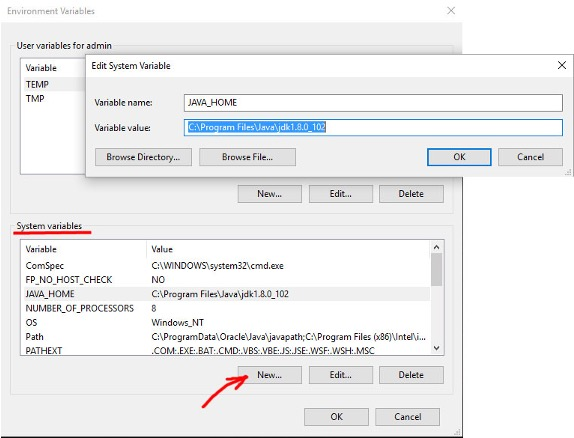
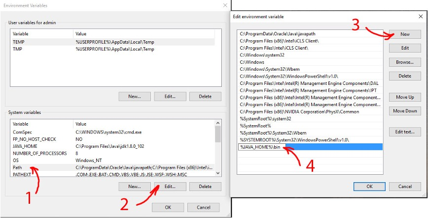
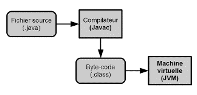
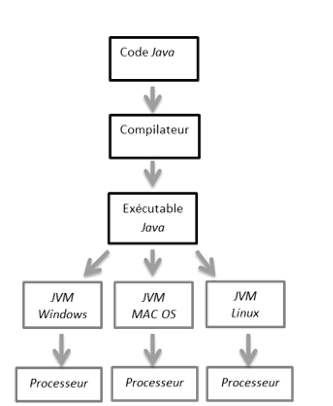
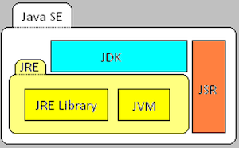

#  Fondamentaux JAVA

## Historique


## Installation

1. Install [JDK](https://jdk.java.net/archive/)
2. Add BIN folder of the JDK to PATH variable `%JAVA_HOME%/bin`





3. Compile with `javac filename.java` command
4. Run your program with `java filename` command


## Compilation



```java
C:\Users\user1>javac helloworld.java
C:\Users\user1>dir
helloworld.class
helloworld.java
C:\Users\user1>java helloworld
Hello, World!
```

## JVM

The Java Virtual Machine (JVM) is the runtime environment for the Java programming language. It is responsible for executing Java bytecode. The JVM is a virtual machine that is implemented in Java itself. It permits the execution of Java programs on a wide range of platforms without the need for a separate native compiler or virtual machine. 




## JavaSE

Java SE is a set of software development tools and libraries that are used to develop applications for the Java platform. It includes the Java Development Kit (JDK), the Java Runtime Environment (JRE), and the Java Standard Edition (SE) APIs.



## Documentation

Java documentation permits you to find information about the Java programming language, the Java SE API, and the Java SE environment. You can explore classes, methods, and other elements of the APIs, as well as the JDK and JRE.

- [Java Documentation](https://devdocs.io/openjdk~21/)

## Les types primitifs

LE types primitifs sont les types de base des langages de programmation. Ils sont utilisés pour représenter des valeurs simples telles que des entiers, des flottants, des chaînes de caractères, des booléens, etc.    

En java, les types primitifs sont les suivants : 
- `int` : représente un entier
- `double` : représente un nombre à virgule flottante
- `boolean` : représente un booléen
- `char` : représente un caractère
- `byte` : représente un octet
- `short` : représente un court
- `long` : représente un long
- `float` : représente un flottant  

Chacun des types simples possède un alter-ego objet disposant de méthodes de conversion identifiable grâce à sa majuscule 
Ex : le type primitif « float » a pour équivalent objet « Float ».

```java
float f = 1.0f;
Float f2 = f;
f2.intValue(); // 1
```

Une variable en java est par convention déclarée avec une minuscule.
```java
int exempleOfInt = 10;
```

## Initialisation et constantes

Pour déclarer une variable, il faut d'abord la déclarer. 
```java
int a = 10;
```

Une variable peut être initialisée à une valeur par défaut. 
```java
int a = 10;
int b = a;
```

Une variable peut être initialisée à une valeur constante. 
```java
final int a = 10;
final int b = a;
```


## Structures de contrôles

Les structures de contrôles permettent de contrôler l'exécution d'un programme. 
```java
if (a > b) {
    System.out.println("a est plus grand que b");
} else {
    System.out.println("a est plus petit que b");
}
```

Les structures de contrôles peuvent être imbriquées. 
```java
if (a > b) {
    System.out.println("a est plus grand que b");
} else if (a < b) {
    System.out.println("a est plus petit que b");
} else {
    System.out.println("a est égal à b");
}
```
## Itérations

Les itérations permettent de parcourir un ensemble d'éléments. 
```java
for (int i = 0; i < 10; i++) {
    System.out.println(i);
}
```

Il est possible d'utiliser une variable d'itération dans une itération. 
```java
for (int i = 0; i < 10; i++) {
    for (int j = 0; j < 10; j++) {
        System.out.println(i + " " + j);
    }
}
```
## Tableaux

Les tableaux permettent de stocker un ensemble d'éléments. 
Une tableau a une taille fixe.
```java
int[] a = new int[10];
```

On peut initialiser un tableau à partir d'une liste d'éléments.
```java
int[] a = {1, 2, 3, 4, 5, 6, 7, 8, 9, 10};
```
