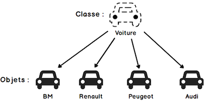
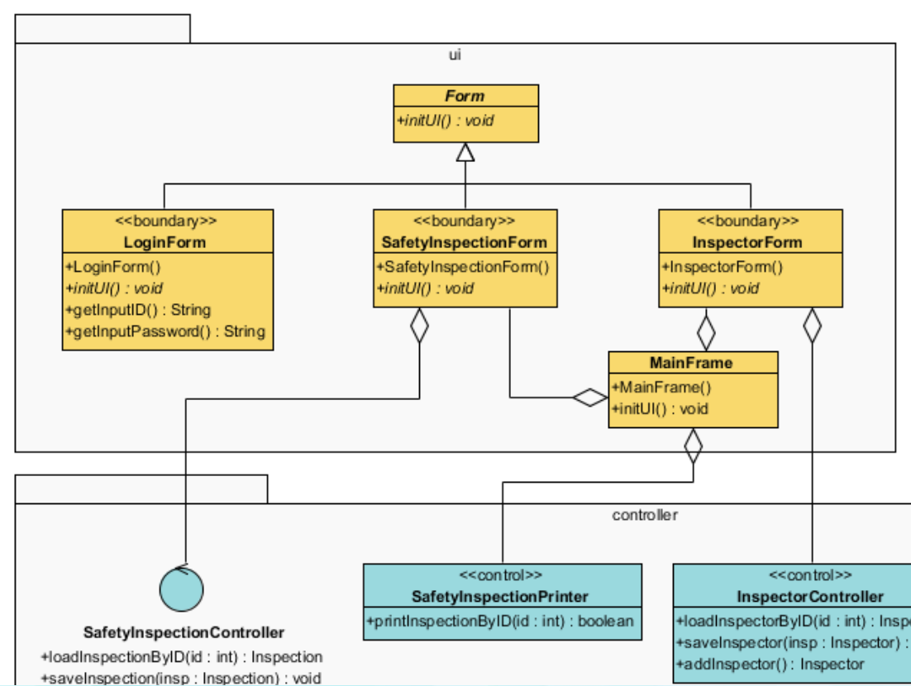

# POO avec Java

## La Classe

Elle est constituée de : 
* Données ce qu'on appelle des attributs 
* Procédures et/ou des fonctions ce qu'on appelle des méthodes

Une classe est un modèle de définition pour des objets 
* Ayant même structure (même ensemble d'attributs)
* Ayant même comportement (même méthodes)
* Ayant une sémantique commune

En java une classe a les caractéristiques suivantes :
* Un nom de fichier « NomDeClasse.java »
* Une classe commence toujours par une majuscule


exemple de classe voiture, avec des attributs et des méthodes
:::details  Classe Voiture
```java
public class Voiture {
    int puissance;
    boolean estDemarree = false;
    float vitesse;
    public void demarre() {
          estDemarree = true;
    }
  
    public int deQuelPuissance {
        return puissance;
    }

    public void accelere(float uneVitesse) {
        uneVitesse = vitesse;
    }
}
```
:::

Les `attributs` sont des variables qui sont stockées dans une classe.
* Variables « globales » de la classe : Accessibles dans toutes les méthodes de la classe
* Variable simple n’est visible uniquement qu’à l’intérieur du bloc d’une méthode.

Les `méthodes` sont des fonctions qui sont stockées dans une classe.


###  Methode statique

 Les méthodes statiques sont des méthodes qui peuvent être appelées sans créer d’instance d’une classe.

Exemple :

```java
public class Statique {
    public static void exempleStatic() {
        System.out.println("Static");
    }
    public static void main(String[] args) {    
       Statique.exempleStatic(); // la methode statique est appelée sans créer d’instance de la classe
    }
```

## L’Objet 

L'objet est une instance d'une classe. A une définition de classe on peut instancier une infinité d'objets.

### Instanciation

* Les objets sont des représentations dynamiques, du modèle défini pour eux au travers de la classe
* La création d’un objet à partir d’une classe est appelée une instanciation
* Une classe permet d'instancier (créer) plusieurs objets
* Chaque objet est instance d'une classe et une seule 



### Constructeur

On a utilisé le constructeur par défaut sans paramètre :

```java
    public static void main(String[] args) {
        Voiture audi = new Voiture(); // Instanciation
        audi.demarre();
        audi.deQuelPuissance();
        audi.accelere(10);
    }
```

* On ne sait pas comment se construit la « Voiture »
* Les valeurs des attributs au départ sont indéfinies et identique pour chaque objet (puissance, etc.) 

#### Rôle du constructeur en Java 
* Effectuer certaines initialisations nécessaires pour le nouvel objet créé
* Toute classe Java possède au moins un constructeur
* Si une classe ne définit pas explicitement de constructeur, un constructeur par défaut sans arguments et qui n’effectue aucune initialisation particulière est invoquée

```java
public class Voiture {
    int puissance;
    boolean estDemarree = false;
    float vitesse;
    public Voiture(Integer puissance) { //Constructeur 1
        this.puissance = puissance;
    }
    public Voiture(Integer puissance, Boolean estDemarree, Float vitesse) { //Constructeur 2
        this.puissance = puissance;
        this.estDemarree = estDemarree;
        this.vitesse = vitesse;
    }
    ...

    public static void main(String[] args) {
        Voiture voiture = new Voiture(10, true, 10.0f);
        Voiture voiture2 = new Voiture(10);
    }
}
```

### Methode principale

La méthode principale est la méthode qui est appelée lorsque l’on appelle la classe. C'est le point d'entrée de la classe.

* La methode principale est équivalente à la fonction main du C/C++
* Elle permet de récupérer des arguments transmis au programme au moment de son lancement

Exemple : 
```java
public class Main {
    public static void main(String[] args) {
        System.out.println(args[0]); // args[0] est le premier argument passé à la méthode main
        Voiture voiture = new Voiture();
        voiture.demarre();
        voiture.deQuelPuissance();
        voiture.accelere(10);
    }
}
```

### Affichage console

### La modélisation

La modélisation est la représentation d’un concept ou d’une idée sous forme de diagrammes. Elle permet de décrire les relations entre les éléments d’un système et de leur représentation graphique. 

L'`UML` est un langage de modélisation qui permet de décrire les concepts et les relations entre ces concepts. [Visual Paradigm](https://www.visual-paradigm.com/) est un outil de modélisation qui permet de créer des diagrammes UML.



## 🧪 Modélisation d'une voiture

Modelisez une voiture en Java.
Une voiture possède : 
* Puissance, 
* Est-elle demarrée, 
* Vitesse
* Un reservoir de carburant
* une immatriculation
* 4 phares avant et arrière
* des freins

Une voiture doit pouvoir : 
* Demarrer, 
* Accelerer, 
* Ralentir
* Freiner
* Allumer ses phares
* éteindre ses phares 

Simulation: 
Je souhaite creer 4 voitures de différentes puissances et simuler leur démarrage, accélération, ralentissement, freinage, allumage et éteindre des phares

## Héritage 

L'héritage est la notion de dériver des caractéristiques d'un objet d'un autre objet. 

```java
public class A {
    private int a;
    public int getA() {
        return a;
    }
}

public class B extends A {
    private int b;
    public int getB() {
        return b;
    }
}
```

Dans l'exemple ci-dessus, l'objet B hérite de l'objet A. Il possède donc les mêmes caractéristiques que l'objet A.

Pour accéder aux méthodes d'un objet hérité, on peut utiliser le mot-clé `super` :
```java
public class A {
    private int a;
    public int getA() {
        return a;
    }
}

public class B extends A {
    private int b;
    public int getB() {
        return b;
    }
    public int getC() {
        return super.getA() + b;
    }
}

public static void main(String[] args) {
    B b = new B();
    b.getA(); // erreur
    b.getB(); // ok
    b.getC(); // ok
}
```

le mot clef `override` permet de définir une méthode qui remplace une méthode héritée. 

```java
public class A {
    private int a;
    public int getA() {
        return a;
    }
}

public class B extends A {
    private int b;
    public int getB() {
        return b;
    }
    public int getC() {
        return super.getA() + b;
    }
}
public class C extends B {
    @Override
    public int getC() {
        return super.getC() + 1;
    }
}
``` 
## Abstraction

L'abstraction est la notion de définir une classe abstraite qui ne contient pas de méthode. 
```java
abstract class A {
    abstract int getA();
}
```

On peut utiliser une classe abstraite comme classe de base pour définir une classe qui hérite de la classe abstraite.
```java
class B extends A {
    @Override
    public int getA() {
        return 1;
    }
}
```

## Interface

L'interface est une collection de méthodes, un contrat. Elle permet de définir les méthodes qui doivent être implémentées par un objet. Ces méthodes sont definis de manière abstraite et ne contiennent pas de code dans l'interface. Elles seront implémentées par les classes qui implémentent l'interface.

```java
public interface A {
    int getA();
}

public class B implements A {
    private int a;
    public int getA() {
        return a;
    }
}
```

Pour utiliser une interface, on peut créer un objet qui implémente l'interface.
```java
A a = new B();
a.getA(); // ok
```

## 🧪 Modélisation d'un parc de voitures

Je souhaite gérer un `parc de vehicules`

Ces `vehicules` peuvent être :
* des 2 roues, 
* des voitures 
* ou des camions

Un vehicule possède : 
* Une immatriculation, 
* un modèle, 
* un prix argus, 
* un kilométrage,
* une date de mise 
* une cylindré, 
* un carburant , 
* un etat ( neuf, quasi neuf, usagé), 
* une liste des défauts, 
* liste d'options

Une voiture possède : 
* un nombre de portes, 
* une nombre de places, 
* une taille de coffres

Un vehicule doit pouvoir: 
* se garer, 
* demarrer, 
* rouler

La vitesse max d'une voiture une `180km/h`

Une voiture implemente : 
* accelerer, 
* ralentir, 
* afficher la vitesse

Dans la simulation: 
Le parc de vehicules s'appelle AutoPlus et possède 1 deux roues, deux voitures de votre choix et deux camions

## 🧪 Modélisation d'un Zoo

Je souhaite modéliser le comportement des animaux d'un `Zoo`
Un `animal` est caractérisé par : 
* Un nom, 
* Une taille,
* Un age, 
* Une durée de vie,
* Un crie Un poids, 
* Espece protégé, 
* Espece éteinte

Un animal doit pouvoir : 
* Vieillir jusqu'à son age.
* Crier

J'ai 4 grandes familles d'animaux dans mon Zoo : Les reptiles, Les oiseaux,
Les poissons, Les Mammifères

Les Mamifères on la particularité :  
* d'avoir un genre (male/femelle), 
* un type de motricité (marcher/nager/)

Les mamifères implémente :
* Allaiter si c'est une femelle 3 fois par jours
* Prodiguer des Soins parentaux 1 fois par jours

Simulation : 
* Vous simulez 100 années qui s'écoulent soit 100 fois 365 Jours et simulez la vie d'un mamifère (Crier , Vieillir, Allaiter, Prodiguer des soins)

## 🧪 Modélisation d'une école

Une ecole est un ensemble de classes

Une classe possède : 
- un tableau, un retroprojecteur capable d'afficher un slide et de s'éteindre, On peut egalement 
  passer au slides suivant/precedent 
- un nombre de tables
- un nombre de chaises

Une salle de cours peut : sonner la recreation, lancer la projection

Les salles peuvent etre : des classes, une salle de pause ou de reunion

L'école possède des climatisations reversibles mobile cable de chauffer/rafraichir la salle à une temperature de 21°
Elles sont actuellement uniquement en salle de pause et de reunion


Simulation :
 l'école `MySchool` possède 5 classes de cours 


## 🧪 Modélisation d'un fastfood

Je souhaite modéliser un Fastfood . Un Fastfood posède : 
* des Tables
* des Chaises
* Une cuisine . Dans cette cuisine il y a : desverres, des fourchette, des couteau, des assiette, une gazinière, un micro-onde

Chaque Fastfood est capable de : 
* cuire des aliments (Différents selon les types de fastfood)


Un fastfood peut etre :
* Une Pizerria
* Un kebab
* Un Barre à Salade 
* Une Sandwicherie
* Un spécialiste du Burger


Une pizerria possède Un four
* un meuble a ingrédients
* Une liste de pizza à la carte


Une pizerria peut occasionnellement implementer une salle de fête :
* gerer une sonorisation 
* illuminer la salle 
* décorer la salle

## 🧪 Projet d'application de Quiz

1. Modéliser une application qui permet de faire un quiz a l'aide de l'UML. 

Voici comment s'utilise l'application de quiz shell : 
```shell
./quiz.sh
1. Quelle est la couleur du cheval blanc d\'Henri IV ?
a) Rouge
b) Jaune
c) Blanc
--> votre réponse est : a
Vous avez répondu correctement
2. Quelle est la couleur du cheval bleu d'Henri VI ?
```

2. Faite valider votre modélisation avec le professeur.
3. Réaliez votre application de quiz


