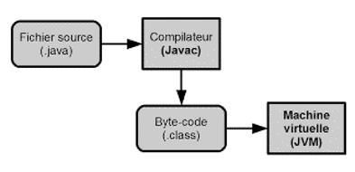

# JAVA

## Installation

1. Install [JDK](https://jdk.java.net/archive/)
2. Add BIN folder of the JDK to PATH variable `%JAVA_HOME%/bin`


3. Compile with `javac filename.java` command
4. Run your program with `java filename` command


## Compilation



```java
C:\Users\user1>javac helloworld.java
C:\Users\user1>dir
helloworld.class
helloworld.java
C:\Users\user1>java helloworld
Hello, World!
```

## JVM

The Java Virtual Machine (JVM) is the runtime environment for the Java programming language. It is responsible for executing Java bytecode. The JVM is a virtual machine that is implemented in Java itself. It permits the execution of Java programs on a wide range of platforms without the need for a separate native compiler or virtual machine. 


## JavaSE

Java SE is a set of software development tools and libraries that are used to develop applications for the Java platform. It includes the Java Development Kit (JDK), the Java Runtime Environment (JRE), and the Java Standard Edition (SE) APIs.


## Documentation

Java documentation permits you to find information about the Java programming language, the Java SE API, and the Java SE environment. You can explore classes, methods, and other elements of the APIs, as well as the JDK and JRE.

- [Java Documentation](https://devdocs.io/openjdk~21/)