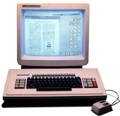
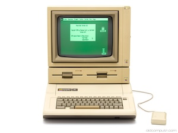
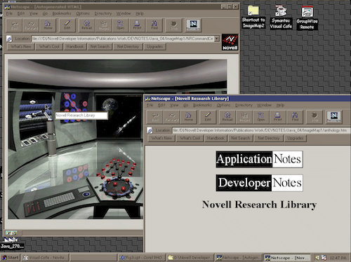
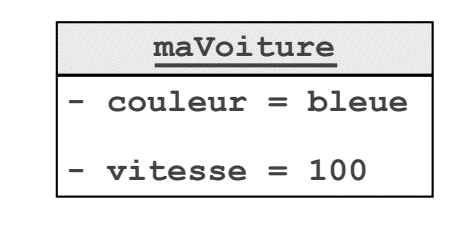
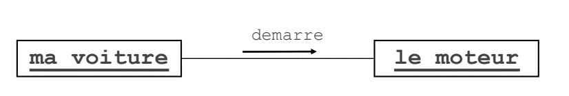
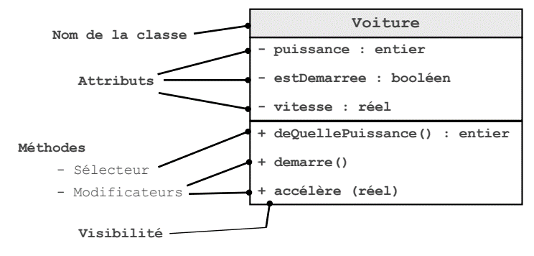

# POO

## Introduction

### Histoire

#### 1960s

- Développement par Xérox du premier système Fenêtres, Icônes et Souris 
- SmallTalk, « archétype » des langages objets 
- Développement par Apple des premiers Mac 

#### 1970s
- Développement des ordinateurs personnels 
- Intérêt pour les interfaces graphiques
- Apparition de nouveaux langages tel que le  C++, extension de C

#### 1980s
- vers une maturité des concepts objets 
- Standardisation de C++ 
- Apparition de langages comme Java ou Python 

#### 1990s

- 1993 : Montée en puissance du Web grâce à Mosaic 
- 1995 : Réalisation du logiciel HotJava en Java permettant d’exécuter des applets
- 1996 : NetscapeTM Navigator 2 incorpore une machine virtuelle Java 1.0 en version « beta » 
- 1997 : Un premier pas vers une version industrielle Java 1.1 
- 1999 : Version industrielle de Java 

### Objectifs

- Facilité la réutilisation de code
- Facilité de l’évolution du code
- Améliorer la conception et la maintenance des grands systèmes
- Programmation par « composants ». Conception d’un logiciel à la manière de la fabrication d’une voiture

## Principes

### Encapsulation
L'encapsulation est la notion de séparer les parties d'un programme qui sont sensibles à des changements internes et qui doivent être modifiées sans modifier le reste du programme.

Exemple : 
- Un objet de type Voiture possède un attribut nombre de places
- Un objet de type Personne possède un attribut nom
- Un objet de type Personne possède une méthode qui renvoie le nombre de places occupées par cette personne

### Polymorphisme

Le polymorphisme est la capacité d'un objet à agir de différentes manières en fonction de son type. 

Exemple :
- Un objet de type Voiture possède une méthode qui renvoie le nombre de places occupées par cette voiture

### Objet

Objet est défini par :
- État : représenté par des attributs (variables) qui stockent des valeurs
- Comportement : défini par des méthodes (procédures) qui modifient des états
- Identité : permet de distinguer un objet d’un autre objet

#### Communication

- Les objets communiquent entre eux par des messages 
- Un objet peut recevoir un message qui déclenche
- Une méthode qui modifie son état et / ou
- Une méthode qui envoie un message à un autre objet ma voiture le moteur

### La Classe 

- Les objets qui ont les mêmes états et les mêmes comportements sont regroupés : c’est une classe
- Les classes servent de « moules » pour la création des objets 
- Un objet est une instance d’une classe 
- Un programme OO est constitué de classes qui permettent de créer des objets qui s’envoient des messages

## 🧪 Hello World

- À l’aide de l’IDE en ligne [online GDB](www.onlinegdb.com)
- Compilez votre première classe Voiture.

